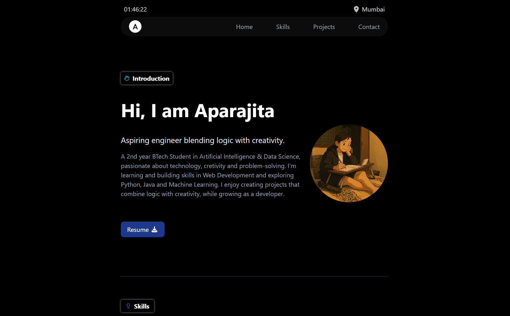
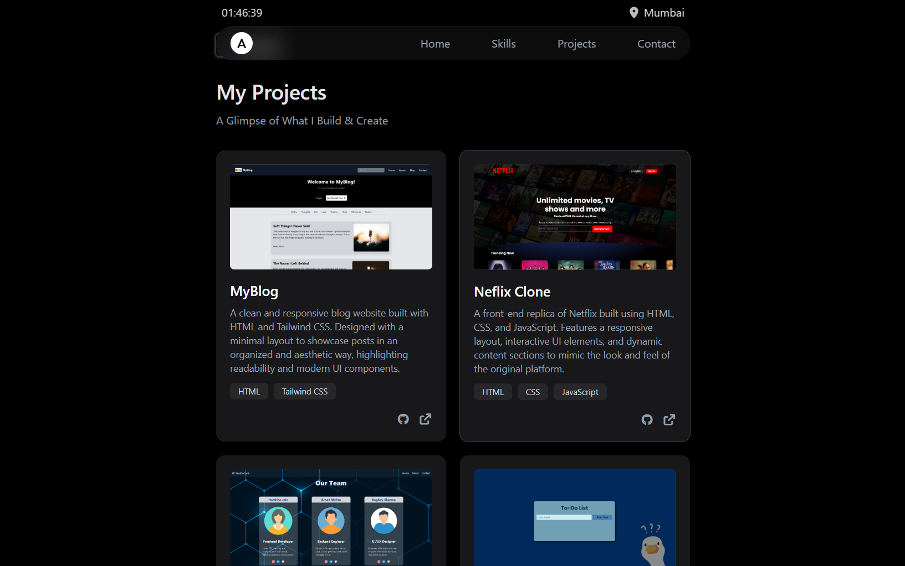
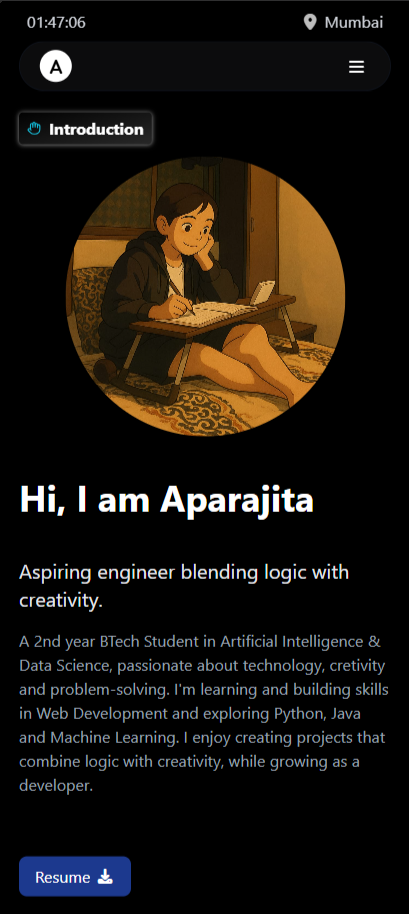
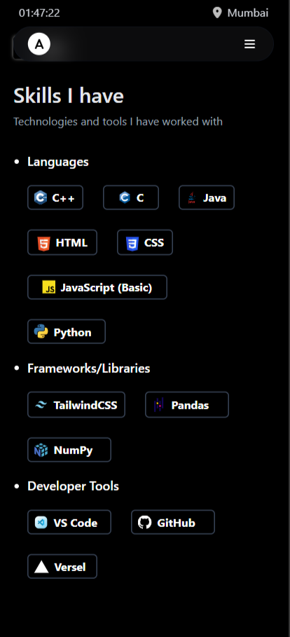

#  Portfolio Website  

A personal portfolio website built with **HTML**, **Tailwind CSS**, and a touch of **JavaScript**.  
It showcases my projects, skills, and provides an easy way to connect with me.  

---

## Features  

- Responsive design for all screen sizes 
- Clean UI powered by Tailwind CSS   
- Interactive navigation menu with JavaScript 
- Sections for **Home**, **Projects**, **Skills**, and **Contact**  

---

## Tech Stack  

- **HTML5** – Structure  
- **Tailwind CSS** – Styling & responsiveness  
- **JavaScript (Vanilla)** – Menu toggle and small interactions  

---
## Screenshots

## Contact 
- Name: Aparajita Singh

- Portfolio Live: [Aparajita Singh - Portfolio](https://aparajitaa.vercel.app/)

- Email: aparajita2419@email.com

---

### This portfolio will keep evolving as I grow and learn new skills.